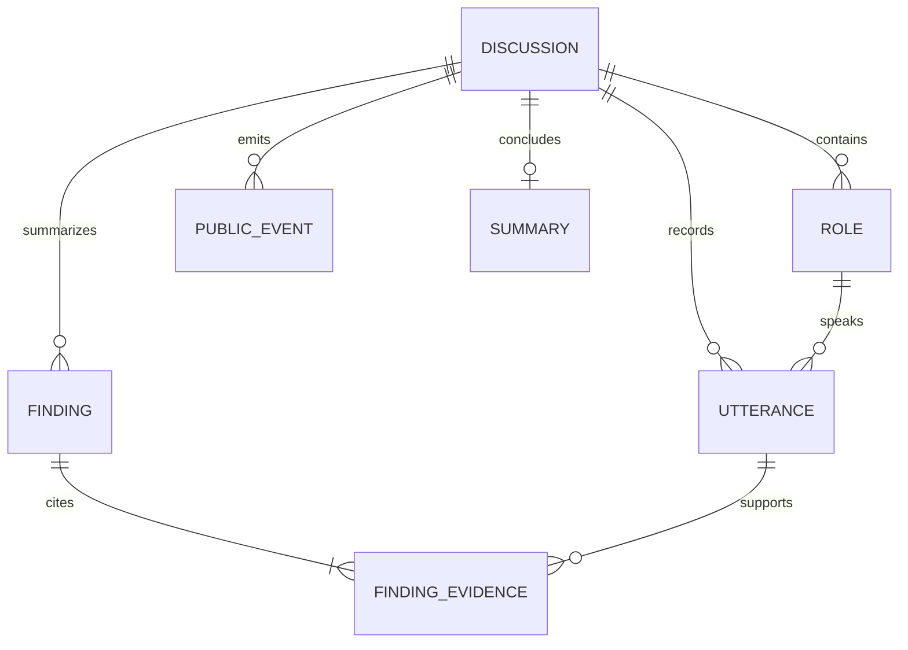
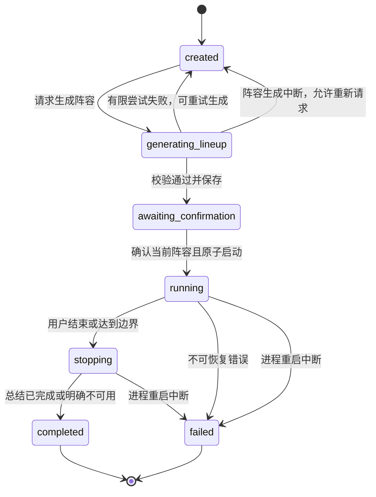
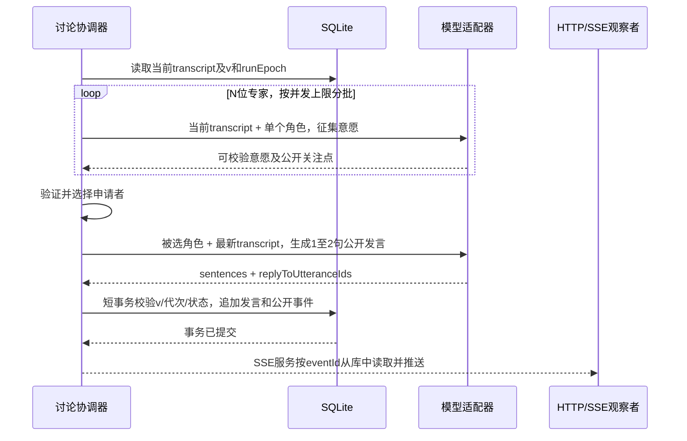
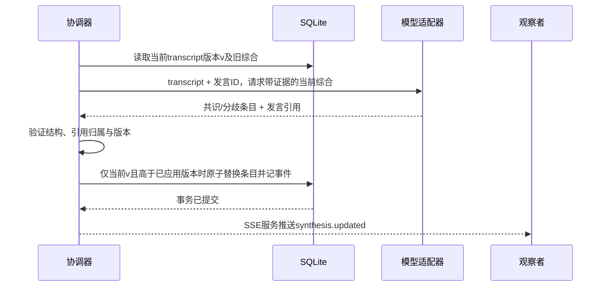

# 架构与动态讨论设计

阶段1A架构在1B按用户授权修订。技术路线、默认限制及运行/收尾重启语义为B类已确认基线；调度细节仍为C类建议，待确认项见 [需求登记](requirements.md)。契约的唯一字段定义见 [contracts.md](contracts.md)。

## 模块与数据访问边界

| 模块 | 职责 | 边界 |
|---|---|---|
| React 前端 | 首页、阵容确认、演播厅；快照与事件合并，呈现公开状态 | 不持有密钥，不决定下一位专家，不调用外部模型 |
| Express HTTP/SSE | 运行时校验、命令分派、公开 DTO、错误脱敏、事件补发 | 不把 ORM/驱动对象、内部任务或模型原响应序列化出去 |
| 讨论协调器 | 每场一个运行任务；征集意愿、选择发言者、主持人介入、结束控制 | 按 discussionId 隔离；开始前已有持久化原子状态迁移 |
| 模型适配器 | 阵容、意愿、公开发言、共识/分歧、收尾总结五类请求 | 仅指定任务和结构化输出；无工具执行；提供商/模型/协议待定 |
| 校验与公开投影 | 校验输入、模型输出、跨记录引用；将白名单内容变为 PublicSnapshot/PublicEvent | 模型不提供隐藏推理给客户端；不把原始响应当错误详情 |
| SQLite 数据访问 | 创建、原子迁移、提交发言/综合、读取快照/事件 | 小型项目专用操作，无通用 ORM 框架；阶段2选用node:sqlite，不向业务泄露 Statement/Database 对象 |

候选数据访问操作：createDiscussion、beginLineup、commitLineup、confirmAndStart、commitUtterance、commitSynthesis、requestStop、finishDiscussion、readSnapshot、readPublicEvents。事务冲突返回明确的版本/状态冲突，由服务层处理；驱动选型不改变 HTTP 契约。

建议单一本地后端进程拥有 SQLite 文件和协调器；开发前后端独立进程，可用 Vite 代理同源访问后端。不得同时启动两个后端共享同一运行数据库。不是多进程协调系统，进程所有权检测方式在 1B 运行准备时明确。

## 数据关系

| 实体 | 最小字段与约束 | 持久化策略 |
|---|---|---|
| Discussion | id、topic、expertCount、status、version、lineupRevision、confirmedLineupRevision、transcriptVersion、lastEventId、synthesisSourceTranscriptVersion、synthesisUpdatedAt、runEpoch、createdAt/updatedAt/startedAt/endedAt、stopReason、createRequestId及输入指纹、lastNotice | 状态/计数持久化；runEpoch、输入指纹为内部字段；创建 requestId 唯一 |
| Role | id、discussionId、kind(host/expert)、name、title、stance、color、status、publicFocus | 角色和最近公开状态持久化；状态是当前任务的投影，重启要纠正为 idle |
| Utterance | id、discussionId、roleId、seq、sentences、replyToUtteranceIds、createdAt | 已校验的公开发言追加保存，不修改历史正文；discussionId+seq 唯一 |
| Finding | id、discussionId、kind(consensus/disagreement)、text、sourceTranscriptVersion | 保存当前有效的一组条目；每次合格综合原子替换，旧版在公开事件中留痕 |
| FindingEvidence | findingId、discussionId、utteranceId | 至少一条引用；分歧建议至少两个不同角色的相异发言，不能仅凭模型标签认定存在分歧 |
| Summary | discussionId、text、sourceTranscriptVersion、status(ready/unavailable) | 每场最多一份终态总结；unavailable 时 text=null，不伪造 AI 总结 |
| PublicEvent | discussionId、eventId、dataVersion、type、payload、occurredAt | 只存公开白名单载荷；discussionId+eventId 唯一；与对应数据在同一事务提交 |

角色/发言/证据须使用复合外键或等效事务内检查，保证同一 discussionId，不能只依赖全局 UUID。启用外键，使用参数化 SQL。时间戳使用服务端 UTC，顺序依据 seq/eventId，不依赖时间精度。

transcriptVersion 每新增一条普通公开发言加 1，与最后一条 seq 相同；不计 Summary。version 每次公开可观察的原子数据变更加 1；一次事务可生成多条事件，它们共享 dataVersion。lastEventId 每条持久化公开事件加 1。各计数均按讨论独立，从 0 开始。

### 运行时内容

内存中仅有协调任务、AbortController、计时器、模型并发信号量、意愿申请、候选评分、待运行综合版本、SSE 连接。不得把运行任务对象存入 DTO。意愿和诊断不进入 PublicEvent；原始模型输出默认不持久化，不记录隐藏推理。诊断只记录错误码、耗时、次数和非敏感关联 ID。

五组样例将保存为可审阅的 SQL/JSON 数据及初始化入口：每组一个不同话题、一个主持人、expertCount 位专家，字段完整、立场差异合理。若补充 transcript，必须标注为样例而非真实模型运行证据；样例不会在运行模式里作为预生成剧本播放。

## 生命周期和重复启动

创建与生成阵容是两个操作。确认与开始合并为一个 `/start` 原子操作：仅当 status=awaiting_confirmation 且 lineupRevision 匹配时设置 confirmedLineupRevision、startedAt、status=running、runEpoch+1。同一短写事务内检查running/stopping总数与容量，避免两场同时start绕过上限。受影响行数只能是 1；重复请求返回已有状态，绝不再次安排开场或任务。若数据库提交成功但进程随即退出，重启按中断语义处理，不隐式再次调用模型。

多个观察者：不同浏览器/SSE 连接读取同一讨论，GET/SSE 都无启动副作用，页面关闭也不停止讨论。多个讨论：每个拥有不同实体、上下文、事件序列、任务和取消令牌；共享的只有全局调用上限与 SQLite 短写事务。

## 动态调度：意愿、协调、发言分开

1. 主持人基于 topic 和已确认阵容生成开场，作为普通公开发言持久化。
2. 协调器读取当前有序 transcript，冻结本次输入的 transcriptVersion=v。将题目、该专家角色、同一场当前完整公开 transcript 传给每位专家的意愿请求；不传其他讨论内容。MVP 限制总发言量，因此暂不增加长期记忆/向量检索或自动截断；超过提供商上下文容量时明确失败并提示，不能静默丢弃最新内容。
3. 意愿结果仅含 wantsToSpeak、intent(answer/supplement/rebuttal/question)、replyToUtteranceIds 和独立 publicFocus；不请求理由链或隐藏思考。协调器只采纳当前 v、当前 runEpoch 的有效结果。
4. 若多人申请，先验证回应目标属于本场且在当前 transcript 内。建议优先回应最近一条发言的rebuttal/supplement，其次其他有效申请；相同优先级按距上次公开发言的等待轮数裁决，再以稳定roleId打破最终平局。公平性不是固定轮转，允许同一专家再次回应，不强制每人恰好一次；更复杂的语义评分不在MVP内。
5. 选中的专家接收最新 transcript 再生成一次公开发言。提交前再次比较 v：若 transcript 已改变则丢弃结果，并基于新快照重新调度，不把旧内容硬接到新讨论上。
6. 专家发言提交后，以新的 transcriptVersion 提取共识/分歧；本轮综合完成或有限失败处理完毕，才发布下一轮专家发言，保证讨论中有可观察的更新检查点。
7. 主持人按可观察条件追问或串联：无人愿意回应，或最新综合产生引用最近专家发言的新分歧时，以当前 transcript 生成简短介入，再重新征集意愿。每个专家轮次最多一次此类介入，避免无限主持循环；是否偏题作为人工质量评审，不增设未定义的模型评分任务。不能预先写好整个主持流程。

意愿不是公开发言，模型角色也不是操作系统进程。专家小窗只是协调器实际阶段的公开投影，不能用循环动画模拟多个“正在思考”的任务。

### 一次公开发言的模型调用路径

N 是专家人数，不含主持人。一次有回应的正常循环需要 N 次意愿请求 + 1 次发言请求；若无重试、无主持人插入，随后再有 1 次综合请求，合计 N+2 次。意愿请求可分批并行，公开发言要等待协调结果，综合要等待发言提交。主持人介入、重试和无人回应会额外增加调用；不估价格，不承诺所有供应商支持同等并发或结构化输出。

### 一次共识更新的模型调用路径

一次正常更新为 1 次模型请求。模型不能自报可信版本；sourceTranscriptVersion 由后端请求上下文设置。要求请求源版本等于提交时当前 transcriptVersion，且大于已应用 synthesisSourceTranscriptVersion；旧结果直接丢弃。只保留最新待处理版本，不为每个历史版本创建无限排队任务。共识条目必须有本场实际发言证据；证据支持程度仍需人工质量检查。

## 异常、并发与终止（1B确认的可配置默认值）

| 情况 | 最小处理 |
|---|---|
| 无人回应 | 主持人基于当前内容做一次澄清提问，再征集一次；仍无人回应则进入 stopping，原因 no_participation |
| 多人申请 | 意愿校验后集中选择一位，其他人回到 idle；下一轮重新基于新 transcript 申请，不沿用旧队列 |
| 意愿超时/无效 | 单次尝试 30 秒，至多重试 1 次；该专家本轮不可用，不假称它主动放弃；其他有效申请可继续 |
| 被选专家发言失败 | 有限重试耗尽后，尝试同一 v 的下一个有效申请者，每位至多一次选择；无有效候选则走主持人澄清路径 |
| 主持人开场/澄清失败 | 有限尝试耗尽则 failed，给可见错误；不编造替代发言 |
| 综合失败 | 保留已发布条目并标注旧版本、发 notice；允许下一轮继续尝试最新版本。建议连续两轮综合失败则收尾，原因 synthesis_unavailable |
| 不可恢复存储/协调错误 | failed，取消任务，保留已提交数据；不返回原始异常栈 |
| 用户结束/12次成功持久化专家发言/进入running起10分钟，先满足即收尾 | 原子 running→stopping，停止新的专家任务；进入冻结 transcript 上的总结流程 |

默认同一时刻最多 2 场执行（running 和 stopping 均计入；不限制历史讨论数或观察者数）；每场最多 2 个外部请求、全局最多 4 个，阵容、意愿、主持人/专家发言、综合和总结均受所属讨论及全局调用槽约束。意愿请求按槽位分批；没有无限队列，创建讨论不占运行槽，启动满额返回 CAPACITY_REACHED。每场 pending 模型任务受专家上限约束。

有限重试统一只由协调服务一层管理，模型适配器/SDK关闭自动重试，避免多层倍增。只重试超时、暂时服务错误和可修复结构错误；确定性的认证/配置错误不重试。30秒是单次完整响应超时，不是首token超时。每类任务总计最多2次尝试，可短暂退避。模型请求并发不等于公开发言并行，同一讨论仍按seq有序发布。12次只统计成功持久化的专家公开发言，主持人发言、意愿与失败请求不计数。10分钟是运行阶段进入收尾的边界：普通意愿/发言/综合不再超过该边界安排新尝试；阵容生成受30秒/次、至多2次限制；stopping另有从进入收尾起60秒的总期限，包含排队、调用、退避与重试，每次实际允许时长不得超过总剩余时间。供应商可能对取消请求继续计费，后端取消不能保证远端停止。全局并发/超时/重试限制以服务端配置为准，不由浏览器任意修改。

## 结束、迟到结果与最小恢复

`/stop` 原子设置 status=stopping、runEpoch+1、冻结 sourceTranscriptVersion，将旧专家任务对应角色重置idle并保存角色事件，提交状态事件后取消旧请求/计时器。即使外部请求无法实际中止，旧代次的意愿、发言、综合都不得提交。重复 stop 不再次增加代次，也不重复调用总结。进入failed时同样取消旧任务并纠正角色状态，不能留有虚假的preparing提示。

唯一允许在 stopping 写入的模型结果是新代次、冻结 transcript 上的 Summary；它由主持人视角生成1–2句自然语言文本；独立长总结是否符合题意保留给出题方确认，不宣称题面明确允许或禁止。已有共识保持其来源版本，不将总结冒充一次新的综合。总结有限尝试失败也进入 completed，但 summary.status=unavailable，页面明确“讨论已结束，总结生成失败”，保留 transcript。completed 表示生命周期已结束，不表示总结或所有质量检查成功。

用户点击结束后不再接受专家发言；总结含排队/调用/重试的总等待不超过进入stopping后60秒，超期取消并标记unavailable；总结迟到也不能覆盖已结束状态。故 UI 先显示“正在结束”，然后才显示最终总结或失败提示。致命错误或进程中断为 failed，不能包装成正常完成。

**D07 已确认重启语义：** created、awaiting_confirmation、completed、failed保持已有数据与状态；仅确实中断的running/stopping在下一次后端启动接收请求之前转为failed，runEpoch+1、角色状态重置idle，并保存公开中断事件。generating_lineup不归为运行中断失败；C类处理细节为恢复到created、使旧生成任务失效并提示阵容未生成，由用户重新请求。保留已有阵容/发言/综合，提示“上次运行中断，可查看记录并新建讨论”。不自动续跑、不复原远端任务、不提供同一讨论二次运行。旧观察者重连得到修正后的快照/事件。

模型调用始终在数据库事务之外；只在读取一致快照、申请状态迁移、验证并落盘结果时用短事务。前端只有在持久化成功后收到公开事件，无法提交的结果不得先展示。

## 阶段2实际模块（其余仍为设计）

- 根package.json/package-lock.json是正式后端依赖；src/domain为输入校验、DraftService及DraftStore操作接口；src/db为SQLite实现；src/http/app.ts只组装Express，不监听；server.ts和init-db.ts分别承担监听与初始化。tools/env-probe保持独立且未修改，不被业务导入。
- 当前只创建discussions/public_events两表，STRICT、外键、请求ID唯一、事件复合主键、人数/状态/版本等约束。仅允许created及version/lastEventId=1；其他实体及运行字段还未建表。草稿中不可能已有的公开内容由白名单投影为空/null。未来完整生命周期须先做非破坏迁移，不以重复CREATE IF NOT EXISTS冒充迁移。
- 创建由服务校验及生成UUID/UTC时间；存储层BEGIN IMMEDIATE中查询幂等键、比较规范化topic/count、插入草稿、插入首条状态事件并提交；任一写失败回滚。存储的topic/count本身作为输入指纹，未冗余存hash。重复请求返回原记录，不递增版本/事件。无模型调用、协调任务或运行容量检查。
- 读取草稿来自单条SELECT，关联的阵容/发言/综合等固定为空，因此快照字段与lastEventId来自同一条已提交记录。列表updatedAt降序、id升序，GET无副作用；active不含created。
- 数据访问层仅向业务提供DraftRecord，驱动对象留在db与启动组合层。读取校验字段类型、人数、当前状态/计数与时间；公开层不展开数据库行。
- 默认开发库data/discussions.sqlite；DATABASE_PATH可改变，不读取模型配置。测试库分别在.tmp/stage-2/case-*及smoke-*，每个场景全新文件。重开保留草稿；运行态重启纠正仍未实现。一个本地后端进程，未建立跨进程所有权锁。

## 阶段3实际前端（后端与数据库结构未改）

正式根package同时管理web/依赖。web/src/App.tsx组织创建、列表、详情三区；controller.ts维护单次提交与两个独立查询代次；api.ts验证未知响应结构、标识与公开字段，复用浏览器安全的输入校验。类型导入被擦除，SQLite/Express/环境配置不进入前端。Vite仅以相对/api代理到本机后端。

创建在事件处理函数中触发；同步busy防重入，冻结规范化输入+requestId。失败保留请求；编辑输入解除旧请求，成功后显式再次创建生成新ID。提交时采用服务端返回快照，不拼装假草稿。列表刷新独立捕获错误，不抹去已保存状态；列表/详情分别递增查询代次，旧success/error/finally均不能覆盖当前结果。刷新不持久化未决请求ID或表单，因此结果不确定时先查全部列表；没有自动POST恢复、轮询或SSE。

Playwright启动正式编译后端、Vite及新建独立SQLite；正常读取链路不替换，故障场景只在明确标注的网络边界注入。测试进程由Playwright管理，不复用个人浏览器上下文或既有服务。
