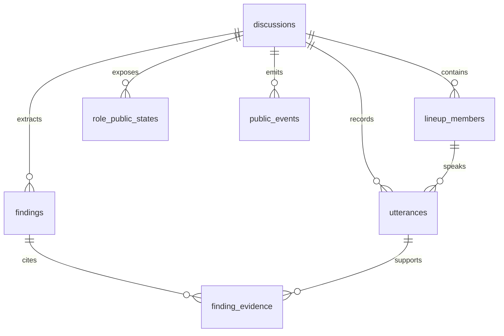
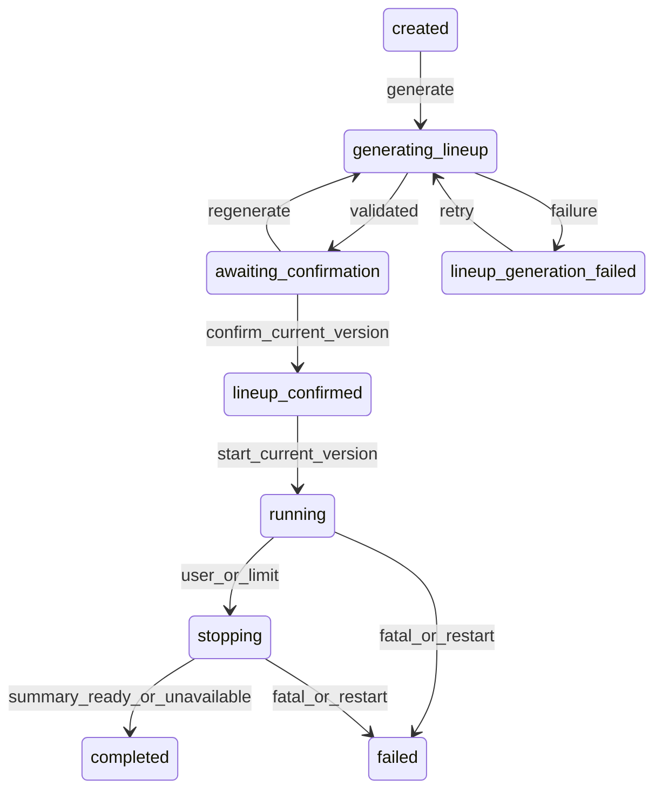
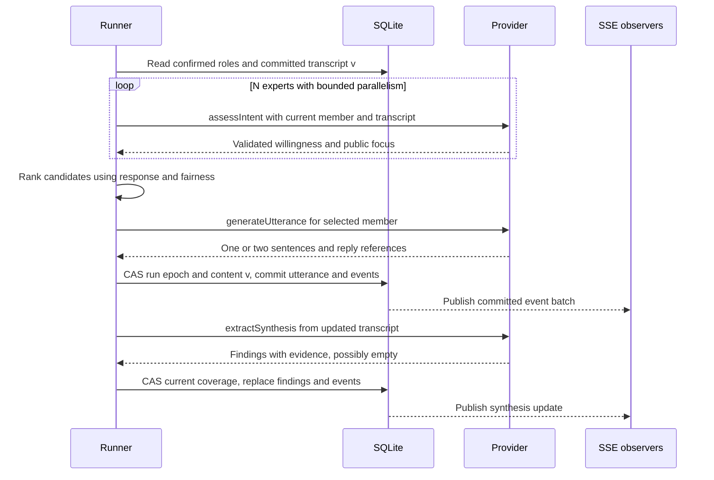

# 架构与动态讨论设计（阶段7当前实现）

本文件描述当前代码；历史演进保留在Git及各阶段验证记录。需求来源与未确认事项见[需求矩阵](requirements.md)，精确HTTP/SSE字段以[契约](contracts.md)为准。数字为用户确认的MVP默认值，不是原题性能保证。

## 模块与运行边界

| 路径 | 当前职责 |
|---|---|
| web/src/App、LineupPanel、Studio | 中文准备/确认/演播厅，分区滚动；React将模型文字作为文本呈现 |
| web/src/controller、discussion-stream、events | 阵容有限轮询；讨论单SSE、事务批次合并、GET恢复、选择与版本隔离 |
| src/http/app、events | 输入白名单、错误脱敏、HTTP命令、SSE补发/背压/清理；不启动观察者runner |
| src/domain/lineup-service | 每代阵容至多两次；运行时验证、代次CAS、确认不启动 |
| src/domain/discussion-service、discussion | 独立四能力、候选协调、公平限制、最新内容、取消和有限收尾 |
| src/providers | Fake/DeepSeek、固定官方传输、任务提示词、单次请求无隐藏重试；调用槽每场2/全局4 |
| src/app-providers、server | 后端独立选择阵容/讨论模式，默认Fake；deepseek还需CLI开关；回环监听、库占用与恢复 |
| src/db | node:sqlite、参数绑定、短事务、001/002/003、公开事件投影；不引入ORM |
| src/sample-data、import-samples、seed | 五组人工虚构预置；稳定创建requestId、系统赋值、整批事务、待用户确认 |
| src/live、live-server、live-stage6b | 历史一次验收保护，与普通入口分离；所有既有授权已关闭 |

正式依赖只有根package/lock，web没有第二套依赖；tools/env-probe是历史实验。一个本地后端进程独占一个库；不是分布式系统。普通真实配置不依赖验收库/固定ID，正常程序限制不是费用授权。

## 当前数据库关系（003）

summary_json、run_id/run_epoch、运行/收尾期限、调用计数和当前阵容代次在discussions；没有独立Summary或通用任务表。lineup_members保存最近成功组，重新生成期间失败仅留作历史、不作为当前可确认结果；新成功组替换原组，旧公开事件保留。findings与finding_evidence保存最新有效提炼，旧版本留在public_events。复合外键及业务校验检查同discussion和角色/发言归属。

公开发言只追加，seq从1连续；transcriptVersion初始0、每条发言+1，summary不计入。snapshot.version创建时1；lastEventId创建时1，此后每个公开事务version+1、多事件共享版本、事件号按讨论连续。快照为同一读事务，提交后通知SSE读取数据库；Provider调用期间没有写事务。

内存只保存runner、AbortController、计时器、并发槽、意愿/候选/公平等待计数、SSE连接。小窗状态是持久化公开投影，不显示意愿评分、内部任务或隐藏推理；原模型响应不保存。

## 生命周期

开始绑定generationId/lineupRevision，持久化runId、请求身份与running后登记唯一runner；重复或双Tab只复用同run。崩溃后下次启动将真正中断的running/stopping记failed，生成中记lineup_generation_failed；不续跑、不重开completed/failed。GET/刷新/订阅无执行副作用，观察者断线不停止讨论。

## 一次专家发言与中途提炼

意愿N次→被选发言1次→提炼1次（达到专家轮次上限的最后发言直接收尾，跳过提炼），每个逻辑任务至多两次尝试。多人申请按当前回应目标/类型与等待公平性协调；不是随机或固定轮流。无人/候选失败由主持人有限澄清；新分歧可触发串联，整场额外主持最多2次。旧内容意愿不进入下一轮；同专家有其他申请者时避免长期垄断。具体排序以domain/discussion.rankCandidates及运行规格为准。

每次发言1–2句且≤既定长度，非法结果拒绝，不截断拼合。共识须至少两位专家引用，分歧有两立场及证据并集；结构关联不等于语义支持证明。提炼失败保留旧覆盖并提示，连续2次失败收尾。sourceTranscriptVersion与snapshot版本分离，小窗变化不会让内容任务过期。

## 预算、收尾与恢复

最多2场running/stopping、每场/全局并发2/4。普通阶段12次成功专家发言或10分钟；单次完整响应30秒，总结60秒。B(N)=28N+56含总结预留2；唯一重试层由service管理，网络与输出修复共享2次。未执行前检查剩余期限和预算。公开事件不暴露内部计数。

stop冻结当前transcript、变更epoch并取消普通任务；总结独立取消域，依据最后提交的完整内容及已有观点覆盖。总结失败显示unavailable，completed不等于总结质量通过；配置/致命错误和重启为failed。迟到结果必须同时匹配run/epoch/内容/状态/期限，不能回写终态。R1短参数仅属于已关闭历史验收，不修改普通默认。

## 维护与样例事务

db:init先验证原schema，001只接管真实旧结构，002阵容，003运行；旧库备份、未知拒绝、待执行迁移整体回滚。server只校验不自动迁移。seed同样获取.owner，必须停服；先校验全部样例、再统一事务创建草稿与阵容状态/事件，重复已存在requestId只读保留，既不确认也不运行。没有新增migration。

Mermaid为当前关系/状态/顺序；渲染核查状态见[交付验证](delivery-validation.md)。更详的已确认调度规则与设计取舍见[运行规格](discussion-runtime-design.md)，历史结果分别见5B/5C/6A/6B记录，不混合证据等级。
