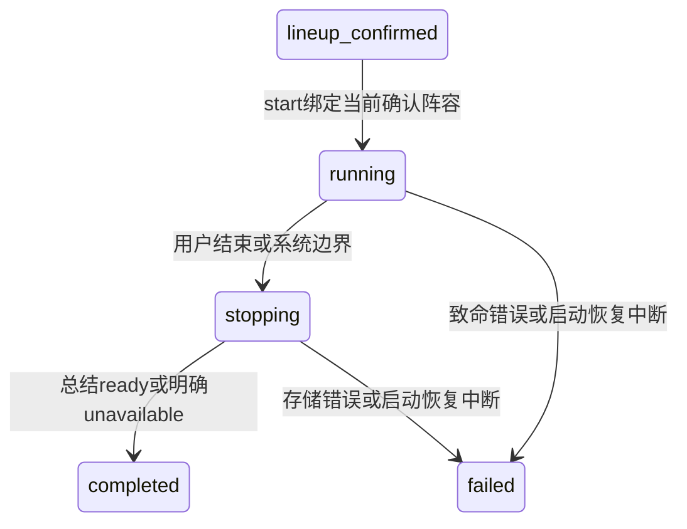
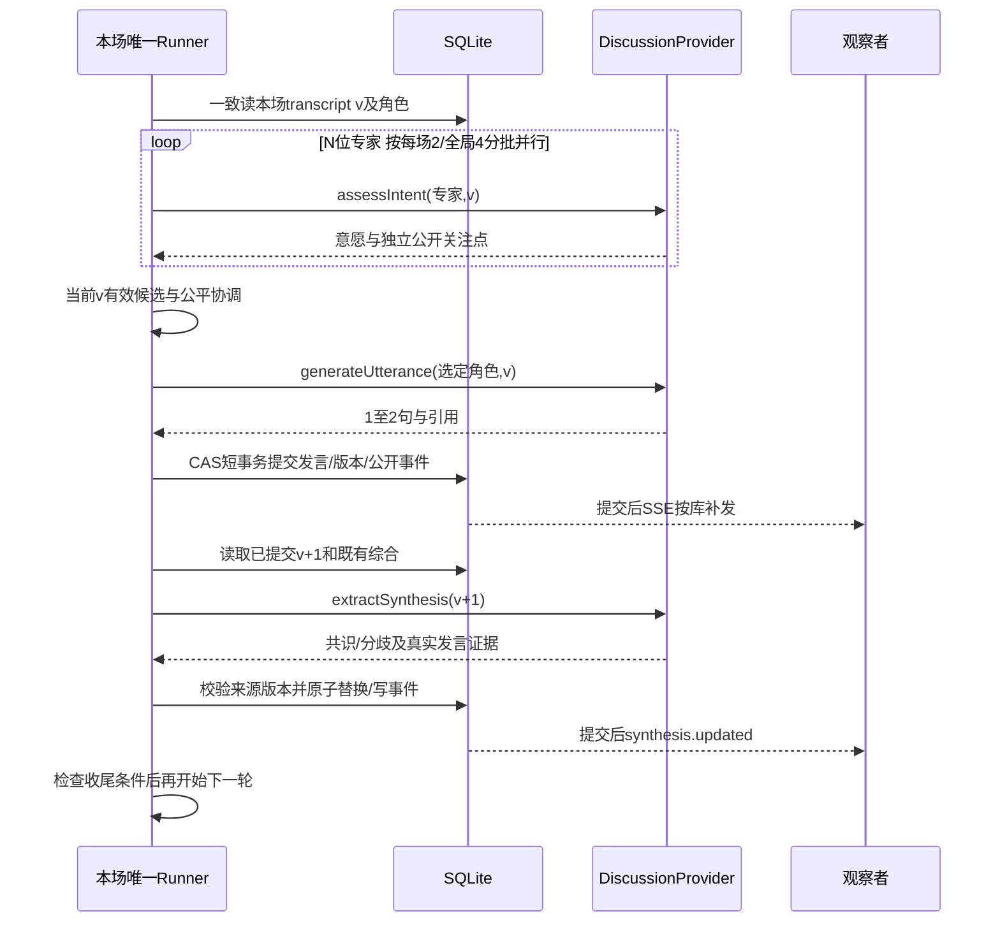
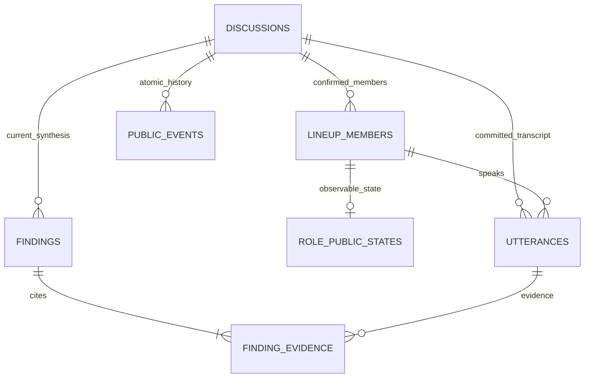

# 阶段5A：讨论执行、调度与实时事件契约（待确认）

日期：2026-09-16。实现基线：`1c8acef`，开始时工作区干净。本文是唯一新增核心规格；HTTP/SSE字段定义在contracts，验收矩阵在test-plan。本轮只完成设计与文档检查，所有5B/5C能力及测试均未实施。

## 1. 来源、范围与真实扩展点

- A：原题R05–R12、R15–R17规定动态回应、短发言、公开状态、增量共识、隔离与实时界面。
- B：用户本轮明确5A设计→5B Fake核心TDD→5C SSE/演播厅；沿用2场、每场/全局并发2/4、单次30秒、12次专家发言或10分钟、收尾60秒。它们不是性能承诺。
- C：本文的排序细节、预算公式、字段/错误码、迁移003和SSE缓冲限制是待确认实现建议，不冒充原题事实。没有新增真实调用许可；stage-4d预算已关闭，整个目录及验收库均不使用、不改动。
- D：真实讨论模型的能力、费用、语义质量与可支持负载未验证。4D仅通过一次阵容，不证明讨论能力。

实际读取如下对象及对应代码，不以报告推定接口存在：

| 已有实现 | 核实结果 | 5B/5C扩展 |
|---|---|---|
| src/domain/snapshot.ts、db/read-discussion.ts | 仅五种阵容状态；transcriptVersion字面量0、utterances为空、summary/synthesis=null；一致读事务 | 运行态联合DTO、发言/综合/总结读取及公开角色状态 |
| db/schema-v1.ts、schema-v2.ts、migrations.ts | 001/002不可变校验和；002仍只允许五态；事件类型CHECK仅status_changed；复合主键(discussion_id,event_id) | 显式003；不能只新增领域枚举而不迁移 |
| db/sqlite-lineup.ts | 每个变更version/event各+1，同事务保存状态与白名单事件；成员表只存最后成功整组，旧组在新成功时替换 | 保留已确认成员；运行中禁止修改；新事件批次分配器 |
| domain/lineup-service.ts | current generation CAS、单调期限、每代2次、取消/永久错误、恢复/close；active是阵容逻辑任务计数 | 新DiscussionService与runner；不能把active当作全应用共享实际调用信号量 |
| providers/roster.ts、deepseek.ts、server.ts、live-server.ts | RosterGenerator只有generateRoster；普通入口明确Fake；真实入口是已关闭的一次性阵容验收 | 新窄讨论Provider，5B/5C只注入Fake；不复用真实验收入口 |
| web/src/api.ts、controller.ts、App.tsx、LineupPanel.tsx | 严格19/21字段；lastEventId===version；仅生成中2秒轮询/最多60次；有选择代次和取消 | 5C扩展运行解析、SSE reducer和演播厅；保留原阵容轮询 |
| src/http/app.ts、db/sqlite-drafts.ts | 尚无start/stop/events路由；active SQL已含running/stopping，但读取枚举和前端过滤不接受 | 真实HTTP命令、列表消费者适配；观察保持只读 |

适用旧规则直接沿用：UUID/UTC毫秒、未知输入字段拒绝、固定中文错误、模型输入与输出运行时校验、短事务、提交后发布、单进程单库、无自动续跑。原R04/R14/D04及旧设计中“真实阵容未执行”的文字是过时状态；4D事实以stage-4d-validation末节为准，不据此扩大真实验证范围。

### 已发现的冲突与处理

| 原约定/实现 | 冲突原因 | 本文建议（非静默修改） |
|---|---|---|
| 旧草案总结失败也completed+unavailable | completed容易被误读为全成功 | 推荐保留原语义，但终态中文由summary联合判断，明确总结失败；已单独询问用户，未答复前保持待确认 |
| 旧草案Role/roleId；已实现成员memberId | 同义字段易混淆 | 不改现有成员字段；发言roleId明确引用LineupMember.memberId |
| 前端lastEventId===version、confirmedAt===updatedAt | 状态小窗/多事件事务后不成立 | 旧阵容分支不改；运行分支分离版本，确认时间固定且不再等于更新时刻 |
| 旧lineup.ready事件 | 实际只有带roles的status_changed | 不新增lineup.ready；历史事件按实际形状消费 |
| 旧runEpoch在stop加1，未区分总结控制器 | 一次abort可能误杀总结 | runId整场固定；普通epoch失效后新summary任务使用新epoch和独立取消域 |
| 旧Finding至少1条证据 | 单专家观点会冒充共同意见 | consensus至少2位不同专家证据；disagreement明确两种立场及证据，单专家不制造共识 |
| 旧整数eventId缺口判断未解释来源 | 全局编号或过滤会产生合法跳号 | 已证实本项目为讨论内手动+1；新事务延续连续分配，完整事件流不按类型过滤，才能按+1检查缺口 |
| 普通入口无数据库所有权锁 | 第二后端可能把活任务误判为重启遗留 | 5B增加同规范化库路径的单实例排他占用，残留占用拒绝自动清除；不是跨进程协调平台 |

## 2. 方案选择

**推荐：单场串行内容决策，意愿受限并行，发言后设综合检查点。** 复用原架构，版本与失败路径最少。每轮必须等综合成功或有限失败处理，代价是额外等待；“实时”指每次已提交变化及时公开，不承诺逐token。

备选：发言继续推进、综合异步合并最新版本。延迟可能较低，但容易使综合持续过时，需要更复杂的赶进度/抢占规则。本MVP不选。两方案均不允许脚本播放、固定轮流或随机选人。

## 3. 生命周期与唯一runner

completed与failed没有返回运行的边；不增加暂停、续跑、重新开播、编辑已确认阵容。completed只表示讨论流程结束：ready显示总结，unavailable必须显示“讨论已结束，总结生成失败”，不能显示“成功完成”；failed提示中断，保留记录，可新建另一讨论。

### 开始

1. 校验start命令，读取当前discussion；匹配generationId、lineupRevision、confirmedLineupRevision，且必须真正有1+N成员。只有lineup_confirmed可新开始。
2. 单进程先预留2场运行容量中的一槽；短写事务内再次检查状态/绑定，生成runId并保存start_request_id、runEpoch=1、startedAt、runDeadlineAt、预算，初始化角色公开状态，写公开状态事件。CAS失败释放预留槽。202只在提交后返回。
3. 提交后登记`Map<discussionId, {runId, runner}>`，同步登记后才调度开场；只由这条命令路径启动。重复start返回现有快照，不从GET或重放请求“补启动”。相同阵容的并发两个Tab即使requestId不同，也最多一次状态提交和一次runner。
4. 提交后登记失败：同进程尝试短事务标failed/RUN_START_FAILED并释放槽，不能留假运行。若在两者之间崩溃，下一次启动先将遗留running标failed/RUN_INTERRUPTED；不自动补发开场。
5. 正常关停取消runner并尽力将running/stopping标中断；崩溃只能在下次启动纠正。恢复事务失败则拒绝监听，GET不承担修复。恢复前必须取得单进程库所有权，不能把另一存活实例的任务判为中断。

同一start_request_id+同绑定重放：返回当前状态包括终态，不新增调用；同键异绑定409。另一requestId在running/stopping且同绑定时返回已有运行；终态的新start一律409，不再次开播。精确HTTP顺序见contracts。

### 结束与终态

所有正常结束条件进入同一requestStop：running→stopping CAS，保存首个stopReason、stoppingAt/stopDeadlineAt、冻结transcriptVersion，runEpoch+1，普通角色状态归idle，状态和角色事件同事务。用户与系统竞争时以先提交的原因为准，后续不覆盖；重复stop不增加epoch或总结任务。

事务提交后取消普通任务域、清除待执行意愿/综合、使taskId无效；然后登记唯一summary任务及独立AbortController，不能将它挂在已abort的普通域。只允许当前runId/新epoch/冻结v/status=stopping的总结提交。总结成功→completed+ready；有限失败/60秒截止→completed+unavailable+SUMMARY_UNAVAILABLE，不伪造文本。若用户在任何发言提交前结束，零transcript不调模型，completed+unavailable+SUMMARY_NO_CONTENT，提示“未产生公开发言，无可用总结”。

致命配置、主持人必要发言失败、不可恢复存储/协调错误直接failed，不启动另一模型任务来掩盖故障。failed若发生在收尾中，summary=unavailable；此前保留已提交发言/综合。无法同时持久化失败态时，沿用4B进程内storage unavailable→相关HTTP503、停止本地任务、SSE断开；不伪造已写入的failed，待启动恢复成功后才服务。

## 4. 版本、上下文与结果接受条件

| 标识 | 含义及改变时机 | 接受判断 |
|---|---|---|
| snapshot.version / event.dataVersion | 每次公开事务+1；一事务可有多个事件 | 客户端公开数据新旧；不作为模型内容过期条件 |
| transcriptVersion / utterance.seq | 每条成功提交的普通发言+1，含主持人；总结不计 | 所有内容任务绑定请求时v；提交时须等于当前v |
| runId | 开始时系统UUID，整场唯一且持久化 | 区分执行身份，不能与generationId混用 |
| runEpoch | 普通阶段1，进入收尾/致命失败/恢复时递增；内部字段 | 使旧阶段结果失效 |
| taskId / attemptNo | 服务端内部逻辑任务UUID及1/2尝试号；当前token有效才接纳 | 同一v也不能让首轮超时结果覆盖第二轮结果 |
| sourceTranscriptVersion | 综合/总结的后端来源版本 | 综合必须=v且>已应用来源；总结必须=冻结v |

固定上下文：本场topic、已确认generationId/revision、完整成员身份；变动上下文：本场按seq的全部已提交transcript、阶段purpose、已保存综合及其source版本。不能拿未提交的生成文字喂下一轮。小窗、心跳、notice改变不使正在生成的发言无效；较旧综合可作为显式标注版本的参考，不伪装最新事实。

只按discussionId限定数据访问，复核所有member/utterance/evidence归属。总发言量有界，不做向量库或长期记忆；输入整体UTF-8建议上限96KiB（应用保护，非模型token保证），超限用CONTEXT_LIMIT停止并failed，不静默截断最近内容。未来真实讨论接入还须单独验证模型上下文限制；现有阵容4096输出配置不是自动批准讨论任务参数。

taskId/attemptNo令牌在进入重试、超时、stop、终态时失效。接受结果时先验证身份/阶段/期限，再解析和验证，写事务取得锁后与COMMIT前再复核；旧成功和旧错误均只丢弃，不追加notice/事件。被取消的远端是否继续执行无法靠本地判断，不声称取消即不计费。

## 5. 意愿、选择与短发言

1. 开场：主持人以当前空transcript生成1–2句，提交后才征集专家意愿。无预生成全场数组。
2. 冻结v，为N位专家各安排一个意愿任务，每场最多2个并行、全局4个，未获得槽时公开状态仍idle。整批意愿窗口最多60秒并受runDeadline限制；未完成者标本轮不可用，不冒充主动放弃。窗口内有效申请全部返回后统一选择，不按网络先到先得。
3. 过滤不申请/无效/超时/过期结果。wantsToSpeak=true时按以下确定性协调顺序：
   - 若最近两条专家发言是同一人且有其他有效申请者，本轮暂排除该人；只有它申请则仍允许。前两次连续发言可发生，符合原T06。
   - 在上述剩余集合中，若有连续申请但未被选择至少3个决策轮次的专家，先在这些有效申请者中选；没有申请的人不被强拉发言。
   - 在余下候选中，回应最新发言的rebuttal/supplement优先；然后按连续未获选择轮数降序、成功发言次数升序、memberId稳定排序裁决。以上只使用可验证枚举、引用和历史，不向模型索要score/隐藏理由。
   - “等待轮数”仅当前轮申请有效且未被选时增加，被选或不再申请清零；这提供持续参与者的机会，无法保证在10分钟/调用预算结束前每个人都发言。
4. 选中角色以同一v生成公开发言；校验及提交后下一次内容决策才能开始。失败最多2次调用；若仍失败，换同批同v的下一有效候选，每位最多选择一次。不重新使用已过期意愿，不无限让失败角色占位。
5. 无人申请：主持人做一次基于当前内容的澄清/追问，然后在新v重新征集；紧接着仍无人有效申请，收尾no_participation。若是所有意愿/候选发言均故障，不能称为专家一致沉默：允许同样一次主持修复，仍全部故障则failed/DISCUSSION_PARTICIPATION_UNAVAILABLE。
6. 专家成功后综合检查点；若新综合首次提出引用最新专家发言的分歧，可主持串联后再征集；不按固定第几轮插播。全场开场之外最多2次主持介入（C，与调用预算一起待确认），避免主持无限循环；介入额度用尽且无人回应时收尾。主持必要开场/澄清失败则failed/HOST_UNAVAILABLE。

意愿、候选和落选不是Transcript。单个专家故障不必终止全场，其他有效申请仍可发言；永久配置错误是整场不可用，立即failed，不换供应商。

### 句子校验（C，运行时可确定执行）

普通输出为sentences数组1–2项，每项trim后1–160 Unicode码点；每项只允许一个句末终止标点组`。！？!?`，位于末尾（允许后跟闭合引号），连续“？！”算一组；内部若出现另一组同类终止标点则拒绝。ASCII句点可用于小数/缩写，但不单独满足本版中文句末要求。引文中多句也拒绝并要求模型重写为短句，明确可能误拒自然语言，人工质量审查补充。

不允许控制字符、代码围栏、HTML标签、可解析为JSON对象/数组的正文或显式think/reasoning标记；允许普通引号和中文内部空格。summary.text用同一规则分出1–2句且总长≤320，不截断或拼造。结构和语义验证失败最多一次完整重写（共享任务两次预算）；两次失败均不落正式发言。纯文本转义+字段过滤不能证明语义绝无隐藏推理或幻觉，真实质量另验。

## 6. 四种讨论Provider能力

新增一个窄`DiscussionProvider`边界，分别有`assessIntent`、`generateUtterance`、`extractSynthesis`、`summarize`四个显式方法，不修改RosterGenerator为万能入口。每种输入、候选结构独立，返回unknown或原始候选JSON由对应验证器处理，不以类型断言当校验。可在未来共享已审阅传输部件；5B不抽取或调用DeepSeek讨论适配器。

所有方法的内部context统一含signal、单调deadline、runId、epoch、taskId、attemptNo、sourceTranscriptVersion、可选repairIssues（最多9项固定path/rule）；这些不是模型可控制系统字段。原阵容context/验收计数不复用。

| 方法 | 专用输入（另含第4节公共上下文） | 精确候选输出及检查 |
|---|---|---|
| assessIntent | 当前expert成员，当前讨论阶段 | wantsToSpeak:boolean、intent:answer/supplement/rebuttal/question、replyToUtteranceIds:0–3个不同本场既有ID、publicFocus:null或1–80码点。wantsToSpeak=false仍须合法字段；不能附理由链/score；只接纳当前v |
| generateUtterance | 被选member、purpose:opening/clarify/bridge/expert、已验证意愿（专家时） | sentences、replyToUtteranceIds；仅这两键。opening可不引用；专家及非开场主持必须至少引用1条已有发言，最多3条，不能引用未来/别场。服务端补roleId/seq/id/时间 |
| extractSynthesis | 当前全部已提交发言含ID/roleId、之前综合及其版本 | items最多12，每项kind/text/evidenceUtteranceIds/positions；约束见第8节；空数组合法；Provider不产生findingId或source版本 |
| summarize | 冻结transcript、最后有效综合和其真实来源版本、stopReason、主持人身份 | 仅text，自然语言1–2句；不得添加id/status/版本/隐藏字段；无发言走第3节零调用分支 |

所有文字长度均按码点，整体候选JSON≤16KiB，与阵容边界一致，未知字段拒绝。输入不是普通浏览器可指定的Provider参数。topics/transcript按不可信数据传入，不允许改变系统职责或读取其他数据。

失败分类：timeout/transport（暂时）可重试；invalid_structure/invalid_content可携安全规则修复；configuration/filtered/cancelled不重试；stale仅内部丢弃；persistence交由服务处理且不重新调用模型。重试只在协调服务这一层，任务最多2次；下次尝试从未耗尽的任务/run期限与次数中扣除，不延长窗口。Provider不循环重试，不静默Fake fallback。

FakeDiscussionProvider必须按显式任务类型/角色/收到的transcript条件给出确定响应；支持0/多申请、同专家两次、跨场引用、非法句数、单角色错误、永久错误、超时、忽略取消的迟到成功/失败、旧综合、总结失败。用受控门闩和假时钟，允许测试断言实际输入；不能在开始时返回整场script或把协调器mock掉。默认运行与测试组合显式注入Fake，即使本地有密钥也不加载backend-config、live-server或真实transport。

## 7. 调用路径、并发与有限总预算

正常一轮N次意愿+1次公开发言+1次综合=N+2次；N=4时6次。意愿可并行，其余必须等待前项结果/提交。失败候选替换、主持追问、重试增加次数，10分钟内不保证一定达到12次专家发言。

**建议独立总预算B(N)=2×[2+12×(N+2)+2×(N+1)]**：首尾各1逻辑任务，12轮N+2逻辑任务，2次额外主持及随后重新征集的N+1，整体乘2为有限重试余量。N=1/4/8时为84/168/280次实际Provider尝试上限。它是保守截止线，不是承诺每条路径都容纳12次：连续故障/换候选也扣同一预算，可能更早结束；不估费用。该建议需用户确认，且不是未来真实调用授权。

- 从总额预留最后2次仅用于总结；普通任务申请调用时若已用达到B−2，进入stopping/call_budget_exhausted，不再发送。最后一个合法预算位预约成功后，允许该次调用在原期限内结束并提交仍有效的结果；不能仅因计数刚到上限而立即取消它。该批已预约调用处理完后、任何下一次普通调用之前收尾；用户结束/总期限仍可提前取消它们。每次实际调用前用短事务增加已用计数，失败/超时不退还；内部计数不改公开version/updatedAt、不制造事件。拿到并发槽并复核任务有效后才预约；事务失败不得发出Provider请求。
- 每逻辑任务≤2次，单次≤30秒，单任务/意愿批次≤60秒（含排队），普通阶段≤10分钟；每次实际deadline取这三个剩余值最小。第12次专家发言的提交事务同时进入stopping，禁止在其后开启综合/意愿；之前已完成中途综合，最终总结依据全部12次。
- runSlot最多2，running/stopping均占；独立的模型调用Limiter全应用4、同discussion2，阵容/讨论/总结共享。必须扩展现有组合注入，不能分别实例化两个“全局4”。保留阵容自身4个逻辑任务的受理上限和原2次生成预算。待调用任务每场≤8、全局≤20，满时返回内部local_capacity，不发送请求、不扣调用次数、不建立额外重排队；按本轮角色不可用/主持失败/综合失败/总结不可用的对应路径处理。公平轮询讨论的任务队列只分配调用槽，不决定发言人。总期限包含排队。
- 本地超时/取消终结attempt并撤销请求/slot与token，迟到结果不可用；网络断开后的远端并行/计费不能由本地上限保证。5B以Fake和本地传输验证本地所有权和清理，不声称验证供应商实际并发。
- 12专家成功提交、10分钟、预算耗尽、无人回应、连续2轮综合失败、用户结束中任何条件先成立即收尾。stopReason原枚举新增call_budget_exhausted；两轮无有效综合才synthesis_unavailable，成功含空items将失败计数归零。

## 8. 增量共识与总结

每次专家发言提交后触发一次综合检查点（若该事务已结束运行则不启动）；输入全部已提交transcript与旧综合。检查点有限成功/失败结束前不决定下一位发言，因此至少第一轮即可出现综合更新，不等全场完成。主持人发言也推进v，但不单独增一次提炼；下次专家后的综合会包含它。没有多版本无限综合队列。

候选items每项：kind=consensus/disagreement，text 1–300码点，evidenceUtteranceIds 2–16个不同ID，positions数组。consensus的positions=[]，证据至少来自2位不同expert；主持人复述不算额外支持者。disagreement恰好2个positions，各有text 1–160与1–8个证据ID，两边至少有不同expert发言，positions证据并集等于顶层证据。所有引用属于本场当前输入且seq≤v。

不把“有两条引用”当作语义证明：Prompt要求实质共同意见/相异主张，自动检查只证明来源与结构；未来人工审查支持程度。界面展示“共同观点（已引用X/N位专家）”，不能自动宣称全体达成共识。N=1没有满足双专家证据的共识/分歧时items=[]，显示“尚无足够公开发言支持共识或分歧”，不得补造。

后端生成findingId和sourceTranscriptVersion，整组原子替换当前条目，包括空数组；旧版本只在公开事件留痕，不累计成失控的结论列表。覆盖条件：当前run/epoch/task有效、running、source v=当前transcriptVersion且v>已应用source；旧结果即使比现有综合新但落后于transcript也丢弃。证据保存与替换、synthesis.updated同事务。

有限失败保留旧综合和真实source，synthesisState标failed（不改变旧内容为最新）；显示“更新失败，当前观点基于第v条发言”，下一轮可继续。不会永远阻塞讨论；连续2个检查点失败则收尾。取消不是合成“成功综合”。

收尾冻结当前transcript和最后综合的实际来源（可能较旧），总结直接基于发言，不能把旧综合当新结论。不再征集意愿/专家发言/综合；唯一summary任务≤2次且stopping总60秒。总结不写Utterance，不增加transcriptVersion，无法结构化证明每个自然语言断言都来自发言，需真实质量检查；无效/超期结果按明确unavailable处理。

## 9. 数据与003非破坏迁移提案

仅设计`003_discussion_runtime`；不新增数据库、ORM、通用任务/attempt平台。runId只允许每场一个，状态/期限/预算存在discussions。继承001/002校验和、备份、显式db:init维护、已知schema严格匹配、事务回滚和启动只校验的机制。

| 对象 | 必要增量/持久化规则 |
|---|---|
| discussions | status放开running/stopping/completed/failed；保留旧列和语义。新增run_id(唯一可null)、start_request_id、run_epoch、started_at、run_deadline_at、stopping_at、stop_deadline_at、ended_at、stop_reason、runtime_notice_code、transcript_version、expert_turn_count、call_limit/calls_used/summary_calls_used、frozen_transcript_version、synthesis_source_version/updated_at/state、summary_json。未运行默认null/0，synthesis state默认idle；内部字段不全部投影 |
| utterances（新，STRICT） | id主键、discussion_id、run_id、role_id、seq、sentences_json、reply_ids_json、created_at。UNIQUE(discussion_id,id)、UNIQUE(discussion_id,seq)；复合FK到本场成员和运行；回复ID在同一事务查归属及更小seq；正文永不修改 |
| findings（新，STRICT） | id、discussion_id、run_id、kind、text、positions_json、source_transcript_version；UNIQUE(discussion_id,id)。只存当前整组，positions保存公开文字，无模型诊断 |
| finding_evidence（新，STRICT） | discussion_id、finding_id、utterance_id、position_index（共识0，分歧1或2），复合主键；复合FK同场findings/utterances；当前组替换先删除关联再条目，同事务重建；不删发言 |
| role_public_states（新，STRICT） | discussion_id、member_id、status(idle/preparing/speaking)、public_focus、focus_source_transcript_version、updated_at；复合PK/FK；仅start为当前确认成员建立，未运行快照不额外加占位字段 |
| public_events（重建CHECK） | 保留原列、主键与全部旧行/payload字节，允许contracts新增类型；不重置event_id/data_version，不用rowid当游标 |
| lineup_members（最小索引） | 现有主键/确认组/身份/颜色原样保留；新增UNIQUE(discussion_id,member_id)供新复合FK；不改成员内容或迁移历史 |

summary_json只保存Summary公开对象或null；不另建一张永远单行的Summary表。非空对象由应用精确校验并加json_valid存储保护；正文/数组有字节保护与运行时码点/引用检查。discussions新增UNIQUE(id,run_id)供utterances/findings的运行复合外键；role_public_states的(discussion_id,member_id)外键指向同场lineup_members。所有新主键显式NOT NULL，计数为非负安全整数且calls_used≤call_limit、summary_calls_used≤2。expert_turn_count=已提交expert发言数，transcript_version=最大seq，由同一提交操作维护，不依赖客户端计数。

状态CHECK必须显式处理NULL：四种运行状态继承已确认阵容所有不变量；confirmedAt不可清空。running必须runId/start/deadline且endedAt为空；stopping有冻结v和收尾期限；终态有endedAt；completed必须summary ready或unavailable；failed有安全runtime_notice_code，summary允许null/不可用。001/002的旧created及四种阵容状态新增运行列保持默认；lineup_error_code只用于原阵容失败，不拿来存运行错误。

准备003时复制**002的全部既有列**，不是沿用002只复制原九列的INSERT，否则会丢确认和代次；公事件、成员ID/关联、姓名/文本字节、确认时间、各版本/幂等键逐项比对。扩大discussions/public_events CHECK需新表复制重建；在维护连接事务外临时关闭FK，全部待迁移版本同事务，保留最终表名/复合引用，最后foreign_key_check和integrity_check，失败整体回滚，恢复FK为ON。未知schema/额外对象/错误校验和停止，不编辑001/002、不删库重建。003原子性和旧002阵容全状态fixture是5B任务，本轮未执行。

### 事务与公开状态

Provider等待绝不持有写事务。每个公开事务version+1；需要m条事件时在该讨论原lastEventId之后分配连续m个编号并更新lastEventId，事件共享dataVersion/occurredAt，提交后仅唤醒SSE读库。发言、seq/专家计数、角色speaking及必要结束状态和事件一起成功，否则全部回滚；前端不预展示模型草稿。

preparing仅对应已取得槽的实际意愿/发言调用；publicFocus只能来自当前v已验证的独立字段。speaking仅在发言提交事务表示刚发布，下一次真实协调阶段重置idle；不使用假延时制造动画。各状态持久化以便GET与SSE一致；重启中断统一idle保留带来源版本的focus。重复相同状态不写事件，心跳不写库。v推进后旧focus可保留但必须标来源，不能称为当前正在思考。

runner/AbortControllers、任务token、意愿/公平计数、重试反馈、队列、连接只在内存；重启不恢复这些任务。持久化run身份/期限用于识别真实中断，不用于续跑；start提交但runner未启动也属于中断，不通过观察行为补发。

## 10. HTTP/SSE与前端边界

精确协议见[contracts阶段5A增量](contracts.md#阶段5a运行与sse契约草案待确认)。公开频道仅：发言、role状态/focus、综合、生命周期、安全notice。候选名单、意愿true/false、竞争、分数、taskId/epoch、Provider原始结果与诊断不进入任何公开通道。

GET快照是读事务内全部公开对象+lastEventId。SSE按同讨论完整事件序列补发；首次after，重连Last-Event-ID；数据库是事实源，先登记通知再追到高水位，通知只触发读库，不能依赖仅内存广播。重复传输由eventId去重，不能说天然恰好一次。多事件同dataVersion须完整应用，推荐缓冲到transactionLastEventId后一次替换前端状态；不因先收到一条就丢掉同版本其他事件。

保留4C生成中GET轮询。5C仅运行态由SSE负责，切换前取消旧轮询和递增选择token；收到start的提交快照→SSE after其游标。已确认尚未开始页可使用只读状态SSE观察另一Tab的start，避免两个独立更新器竞争；阵容生成的旧轮询不强制迁入SSE。新的GET重置必须先关闭旧连接，统一以snapshot游标重建，旧回调失效。

前端待新增：已确认阵容开始按钮；running/stopping/终态联合显示；只渲染utterance.created的Transcript；角色状态/focus来源；综合证据跳转和来源版本/失败提示；结束与总结；连接状态独立于业务状态。终态不再显示可开始按钮，completed+unavailable使用失败提示。保留原中文字号/颜色和各区独立滚动；窄屏区域切换只清理或重建观察连接，不停止runner。

## 11. 5B/5C边界与待确认决定

**5B（后续另行启动）**：003及旧002夹具、DiscussionProvider/Fake、四类运行时验证、唯一runner、开始/结束HTTP、短事务与公共事件、预算/全局槽/取消/恢复、运行snapshot。单元+真实SQLite/HTTP集成TDD。原前端不会解析运行态，因此5B不在旧前端上暴露开始；只能独立Fake测试库验证，不能宣称与现有UI兼容上线。保留草稿/阵容回归。

**5C（后续另行启动）**：SSE真实传输/补发/背压、运行态前端解码与统一reducer、演播厅各区、跨Tab/两场隔离/断线恢复的浏览器E2E。端到端运行真实React/Express/SQLite/SSE，只在讨论Provider边界用Fake。可先通过5B导出的提交通知钩子实现SSE，5B不提前建设通用事件总线。

两阶段都不实现真实DiscussionProvider、不加载私有配置、不复用stage-4d入口/预算/验收库；真实讨论接入需要后续明确授权和独立受限设计。阶段4D的阵容实证不计作讨论测试。

待确认只集中三组：①保留completed+summary.unavailable并明确失败文案；②接受串行综合检查点、持续申请3轮优先/有他人申请时不连续第3次、最多2次主持介入；③接受按N的84/168/280次总预算（预留2次总结）及预算用尽收尾。其他字段/接口为本文推荐草案，可随审阅修订；未获确认不进入writing-plans或实施。

## 12. 文档自查与协议依据

已做文档交叉核对：运行与阵容身份分离、三种版本分离、公开/内部字段分开；start幂等及stop唯一总结覆盖；003明确保留002所有列和旧payload；不把未实现的事件/Provider当现有能力；所有S5用例为计划。本轮没有产品测试、迁移、配置检查、服务启动或模型请求；没有读取私有配置或stage-4d-live数据库。

SSE的Last-Event-ID、UTF-8和终止重连语义参考[WHATWG Server-sent events](https://html.spec.whatwg.org/multipage/server-sent-events.html)；有限背压依据[Node HTTP response.write](https://nodejs.org/api/http.html#responsewritechunk-encoding-callback)。本文的游标检查、批次原子应用、缓冲阈值是本项目设计选择，非协议天然保证；尚未在5C执行验证。
