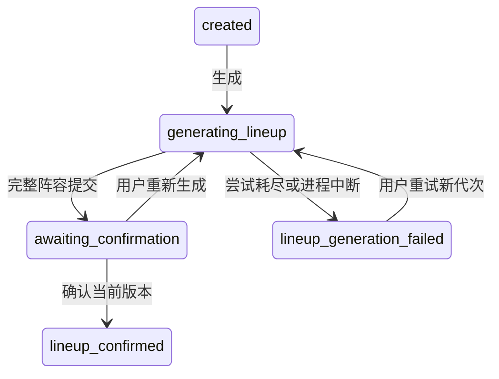

# 阶段4A：阵容领域、迁移与Provider边界设计

状态：**阶段4A设计已由用户P6确认，阶段4B已按此基线实现Fake阵容后端与最小消费者兼容**。原4A审阅过程与当时基线保留在第1/8节，不能把它们当作当前实现状态。实际计划见[4B实施计划](superpowers/plans/2026-09-16-lineup-backend.md)，结果见[4B验证记录](stage-4b-validation.md)。未接真实模型、未实现完整阵容UI。

## 1. 真实基线与冲突

已读取AGENTS、requirements、architecture、contracts、test-plan、ui-spec、stage-2/3-validation，src/db、src/domain、src/http、初始化/启动组合入口，web/src/api/controller/App，以及Git状态/历史。起始工作区干净，main最新03cf8ea；仓库身份仍是用户暂定schen / cs064210@163.com。

### 当前数据库和API（不是未来设计）

| 当前对象 | 实际定义 |
|---|---|
| discussions，STRICT | id TEXT主键；topic TEXT非空，UTF-8字节长度1–2000；expert_count INTEGER非空1–8；status TEXT只能created；version INTEGER只能1；last_event_id INTEGER只能1；create_request_id TEXT非空唯一；created_at/updated_at TEXT非空 |
| public_events，STRICT | discussion_id TEXT外键→discussions.id；event_id/data_version INTEGER正数；type TEXT只能discussion.status_changed；occurred_at TEXT非空；payload TEXT非空且json_valid；主键(discussion_id,event_id) |
| 初始化 | BEGIN IMMEDIATE + CREATE TABLE IF NOT EXISTS；foreign_keys=ON，busy_timeout=3000；没有schema_migrations，也没有应用设置user_version的逻辑 |
| 领域类型 | DraftRecord.status仅created，version/lastEventId字面量1；DraftSnapshot.roles为never[]，其他运行内容为空；不存在已实现的完整状态枚举 |
| 创建 | POST /api/discussions；topic、expertCount?、requestId；首次201、幂等重放200、冲突409；创建与首事件同事务 |
| 查询 | GET /api/discussions/{discussionId}及GET /api/discussions?status=active或all；默认active；排序updatedAt降序、ID升序；active SQL预留generating_lineup/awaiting_confirmation/running/stopping，但当前表无法存这些状态 |

当前公开snapshot恰好19字段：discussionId、topic、expertCount、status、version、lastEventId、createdAt、updatedAt、lineupRevision、confirmedLineupRevision、transcriptVersion、roles、utterances、synthesis、summary、lastNotice、stopReason、startedAt、endedAt。初态created，version/lastEventId=1，lineupRevision/transcriptVersion=0，confirmedLineupRevision及所有未发生对象/时间为null，roles/utterances=[]，createdAt=updatedAt，UTC ISO毫秒。数据库行通过显式投影返回。

默认data/discussions.sqlite在本轮核查时不存在；没有读取环境变量去猜用户自定义库路径。只读打开保留的最终阶段2冒烟库.tmp/stage-2/smoke-mFF73x/smoke.sqlite，确认上述两表和user_version=0，无迁移表。先查看的旧case-0WwOur测试库仍是早期length(topic)1–500约束；它不是最终schema，不能自动登记为001。未读业务正文或改动任何数据库；用户可能在其他路径使用的库版本未验证。

| 冲突 | 本轮处理建议 |
|---|---|
| 旧文档确认即/start进入running | P5明确拆开，新增lineup_confirmed和/lineup/confirm；本子系统不启动讨论 |
| 旧Role为id、kind(host/expert)，无profession | P5明确采用memberId、role(moderator/expert)、profession和title分别保存；现无成员表或非空角色DTO，无存量成员重命名迁移 |
| 旧失败/重启回created | 改为lineup_generation_failed和安全原因；保持“不自动续跑”的已确认原则 |
| 旧/lineup空对象、ready重复只读 | 改为有requestId与基代次的命令；ready可显式整套重新生成；没有无限幂等记录平台 |
| 阶段3前端只接受created/版本1/空roles，错误固定按状态码 | 4B接口扩展会被旧UI拒绝；4B须含最小消费者兼容修订和草稿回归，4C再开放阵容操作。不可把后端单独切换后称为兼容上线 |
| 配色约定 | 旧契约已规定后端固定配色，与P5无冲突；但没有已验收的9成员调色板，不能声称已有UI实证 |

## 2. 方案取舍与领域模型

推荐在Discussion保存当前生成代次，另建当前阵容成员表；generation历史由现有公开状态事件和脱敏诊断追溯。不建独立generation_attempts表：本阶段不需要查询每次模型调用、重放任务或自动恢复。备选是独立attempt表，可查询失败历史，但增加生命周期、保留策略和关联约束；当前恢复与并发条件用单行CAS足够，暂不选。

公开集合沿用snapshot.roles，不并列创建roster/members双份数组。Role的阵容形态为LineupMember：

| 字段 | 来源、校验 | 持久化/公开 |
|---|---|---|
| memberId | 系统UUIDv4；同一成功阵容的刷新/重复确认保持不变；重新生成成功后整组新ID | 是/是 |
| role | 模型枚举moderator或expert，经计数校验 | 是/是 |
| name | 模型纯文本trim后1–64 Unicode码点 | 是/是 |
| profession | 模型职业领域，trim后1–80码点 | 是/是 |
| title | 模型职位/头衔，trim后1–80码点；不从profession自动复制 | 是/是 |
| stance | 模型公开立场/主持人的主持原则，trim后1–200码点 | 是/是 |
| color | 系统调色板按displayOrder分配；统一小写六位hex | 是/是 |
| displayOrder | 系统：主持人0，专家按已校验输出中专家相对次序1…expertCount；不重排成模型发言顺序 | 是/是 |
| discussion_id、generation_id、generation_version、name_key、created_at | 系统关联、去重键、整组成功提交的UTC时间 | 是/否；外层快照提供归属/版本 |

恰好1位主持人+N位专家。成员不会有运行status/publicFocus占位，未实现的专家运行状态不能由模型虚构。模型及HTTP客户端都不能控制memberId、数据库关联、状态、各版本、创建/确认时间、颜色和顺序；未知字段直接拒绝。未来发言引用中的roleId概念指向memberId，届时单独扩展，不在4A定义发言接口。

候选固定调色板顺序：#193455、#2157a5、#137568、#8b4c20、#734a9c、#9d3659、#496625、#345d78、#704d00。0为主持人；专家取前N个后续色。同场不重复，入库后不因UI主题变化重算。与白色对比度本轮只读计算分别12.62、7.07、5.57、6.66、6.59、6.76、6.54、7.04、7.63；仅用于边线/白字色块，正文用既有深色，文字角色标签始终存在。**九色卡片实际UI、色觉和相邻辨识尚未验证，4C须验收后才能宣称调色板经UI验证**；允许确认前调整候选色，不让模型自行选色。

## 3. 生命周期、重复与恢复

| 用户概念 | 推荐沿用的状态 |
|---|---|
| generating_roster | generating_lineup（沿用） |
| roster_ready | awaiting_confirmation（沿用） |
| roster_confirmed | lineup_confirmed（新增） |
| roster_generation_failed | lineup_generation_failed（新增） |
| ending | stopping（保留未来命名；本子系统不写入） |

| 当前状态 | 新生成命令 | 确认命令 | 查询/页面刷新 |
|---|---|---|---|
| created | 允许 | 409 LINEUP_NOT_READY | 原草稿快照 |
| generating_lineup | 同requestId重放202；不同ID409 GENERATION_IN_PROGRESS，不允许强制顶掉当前任务 | 409 LINEUP_NOT_READY | 显示真正生成中；刷新不重复调用模型 |
| lineup_generation_failed | 允许新requestId重试；原ID只返回原失败现状 | 409 LINEUP_NOT_READY | 失败原因与重试动作，非运行失败 |
| awaiting_confirmation | 允许基于当前代次重新生成 | 当前双版本匹配才允许 | 完整持久化阵容 |
| lineup_confirmed | 409 INVALID_STATE（包括原生成ID）；不允许重新生成 | 相同版本200重放，旧版409 | 已确认，尚未开始；confirmedAt不变化 |
| running/stopping/completed/failed（未来） | 全部409 INVALID_STATE | 不产生任何改变，409 INVALID_STATE | 未来只读语义保留；002不支持写这些状态 |

查询始终无生成/确认/修复副作用。进程启动在监听前，短事务将确实遗留的generating_lineup标记lineup_generation_failed，finishedAt=恢复时间、notice=LINEUP_INTERRUPTED、version/event各+1；不增加generationVersion，不重新调用Provider。其他状态原样保留，已确认不撤销。启动无法提交恢复事务则拒绝监听。单进程单库是运行前提，不引入跨进程任务协调。

4C只在选中且可见的generating_lineup详情上串行GET观察，建议间隔1秒（C类UI选择）；响应后再安排下一次，不并行堆积；离开/隐藏即停，恢复页面先GET。失败可手动重新加载；该轮询不是SSE，也不是假进度。页面关闭不停止已受理任务。4B仅验证HTTP查询可恢复，UI操作在4C落实。

## 4. 生成代次与CAS规则

明确区分三种整数：Discussion.version为公开原子变更序号；generationVersion是每次**逻辑生成命令**的代次；lineupRevision为最后一次成功阵容的generationVersion（可跳号）。模型网络重试/修复不新建generation，也不增加这些版本。

Discussion持久化current_generation_id、generation_version、generation_request_id、generation_base_id、generation_started_at、generation_finished_at；有效旧阵容另由lineup_generation_id和lineup_revision标识。初态ID/null、generation_version=0、lineup_revision=0。受理时服务端生成UUID，在BEGIN IMMEDIATE内比较客户端expectedGenerationId与当前ID；相等且状态允许才将代次+1、保存requestId及基代次、进入generating_lineup。提交后才在内存登记并调用Provider，无事务跨模型等待。

结果提交使用讨论ID+generationId+generationVersion+status=generating_lineup作为CAS条件，且未超过该代次60秒总期限。先查条件，过期/失效即丢弃，不能把旧输出校验失败记在新代次上。成功整组保存、更新lineupRevision/lineup_generation_id、状态awaiting_confirmation、finishedAt及事件在一个事务；受影响主行必须为1。

每个当前任务有本地总期限计时器；到期时取消等待并以相同ID/版本/生成中状态CAS提交LINEUP_TIMEOUT失败，再释放该逻辑任务。若响应恰逢期限，由成功提交的期限检查与失败CAS决出一次状态改变，不允许只丢弃结果却永久停在generating。失败终结CAS不要求“尚未超时”；它要求仍是当前生成中。计时用单调时钟，startedAt用于公开UTC和重启识别，不用修改系统时间模拟计时。已失效旧任务的计时器/失败回调同样不能改变新代次。

重新生成期间，旧完整阵容仍留在成员表，lineup_revision保持旧值；公开roles暂为空，确认禁用，不把旧卡片当新结果。新结果成功时事务内整组替换旧成员；失败保留旧成员但不开放确认。这样失败不破坏旧存储，也不引入“恢复旧版”功能。当前快照只在ready/confirmed投影有效阵容。公开状态事件保留曾经提交的阵容，成员表不成为无限版本档案。

**A/B实例：** A=g1超时并落为failed；用户新请求B=g2，B先成功并成为lineupRevision=2；提供商忽略取消，A随后返回。g1不等于当前g2，直接丢弃，不增加version/event、不改变notice/roles。A仍为generating时不接受B；这不妨碍验证上述物理迟到场景。确认后状态和双版本条件同样使A/B重复回调无效。取消只能尽力请求，不能承诺供应商远端停止或不计费。

确认body必须提供当前generationId与lineupRevision；事务内验证它们等于current_generation_id、lineup_generation_id、generation_version及lineup_revision，再设置confirmed_lineup_revision/confirmed_at、status=lineup_confirmed和事件。两观察者并发确认，一次真实提交，后者相同版本200重放。确认与重新生成竞争只允许一个先提交；另一方409并GET刷新。

生成幂等仅保存**当前一代**的requestId+expectedGenerationId：同ID同基代次在可查询的生成/ready/失败状态返回当前快照，不再调用；同ID不同基代次409 IDEMPOTENCY_CONFLICT。新代次接替后，旧请求的基代次必已过时，409 STALE_GENERATION；不承诺无限历史请求重放。确认/运行锁定状态优先禁止生成，防重试旧生成请求绕过确认。

## 5. Provider边界和验证管线

领域依赖一个窄边界RosterGenerator；具体适配器不含SQL、讨论状态迁移或重试调度。概念操作generateRoster(input, context)异步返回候选正文或分类错误：

- input：discussionId、topic、expertCount、constraints（恰好1 moderator+N expert、精确字段白名单、文本长度、禁止理由链/系统字段、只输出单个JSON对象）。每次从本场持久化数据构造，不接受浏览器替换topic/count或模型地址。
- context：AbortSignal、单次剩余deadline、可选repairIssues（仅字段路径+固定规则码，最多9项）。generationId用于本地关联，不要求模型回显；HTTP客户端不能传Provider配置。
- result：候选JSON字符串。Real adapter只抽取约定供应商content，丢弃envelope推理/usage/diagnostic；FakeRosterProvider也返回相同正文或同类错误，能受控延迟/超时/迟到，不绕过生产校验器。认证、传输协议和模型ID在真正接入前另行核实，本轮不预设。
- 候选业务结构为顶层roles数组，每项**仅**role、name、profession、title、stance。业务成功结果是验证规范化后的候选成员集合；系统补齐后才成为LineupMember集合。Provider不返回可信数据库实体。

流水线：raw（只在内存、最多16KiB UTF-8，C限制）→完整JSON.parse一次（不剥代码围栏、不抽大括号、不接收多个对象）→结构校验（根对象仅roles、数组、字段类型/枚举/未知键）→业务校验（精确人数、非空trim预览、长度、重复）→trim规范化→系统ID/颜色/displayOrder补齐→CAS短事务。业务校验使用与最后规范化一致的trim视图，避免“空格姓名”先通过后变空。

重复成员按name_key=NFKC(name).trim().合并Unicode空白.转小写判重，主持人与专家一起判；存展示name只trim，不暗改中文内部空格。相同职业但不同姓名允许；同名专家即使title不同也拒绝。语义近似而名字不同无法由此规则完全识别，另作人工质量审查，不能声称自动证明角色观点充分多样。角色文本不允许控制字符U+0000–001F/007F（多行需求不在本版），中文/引号/正常空格保留。

displayOrder不是模型输出，按系统规则唯一连续0…N。无效role、字段为空、人数错误归business-invalid或structural分类如下。模型输出系统字段、reasoning、debug等即结构失败；不默默忽略。输出文本永不执行，注入性话题不能覆盖系统约束；字段校验不能证明不存在伪装在正常文本里的推理，未来真实模型检查及人工审查仍必要。

### 尝试预算和失败分类

每个逻辑generation最多**2次Provider调用总计**，不是网络2次再修复2次。单次完整响应最长30秒，总代次最长60秒（从持久化受理起，含本地等待及验证）；不设无限队列，无可用槽先429且不写generating。每讨论至多1个有效逻辑任务，沿用全局4、每讨论2的外部调用上限，重试也占槽。下次调用只在旧尝试已本地终结后安排；适配器/SDK禁自动重试。忽略取消的远端执行数量无法由本地证明，须在真实接入时验证和披露。

首次暂时transport/timeout：剩余一次作为普通重试，仍原input，无修复反馈。首次结构/业务错误：剩余一次作为修复调用，只给固定规则码和当前约束，不回传原始错误正文或隐藏内容。第二次无论何因失败即结束；若第一回网络失败、第二回结构错误，不再给第三次。鉴权/配置等永久错误不重试。用户点击重试是新逻辑generation，不是自动突破原代次上限。

| 类别 | 安全notice.code / action | 处理与HTTP边界 |
|---|---|---|
| provider transport failure | LINEUP_PROVIDER_UNAVAILABLE / try_again；永久配置问题为LINEUP_PROVIDER_CONFIGURATION / none | 已202则异步写失败，GET200提供notice；不改为HTTP500 |
| timeout | LINEUP_TIMEOUT / try_again | Abort、有限预算、到期failed；迟到结果丢弃 |
| 非JSON、形状/字段/类型/role非法 | LINEUP_INVALID_STRUCTURE / try_again | 最多一次修复，仍失败后原子标失败，不存半套阵容 |
| 数量、空/超长文本、重复成员 | LINEUP_INVALID_MEMBERS / try_again | 同上；提示“生成的成员不符合要求，请重试” |
| stale generation result | 无公开notice | 内部STALE_GENERATION_RESULT，丢弃；不污染新代次或增加事件 |
| local persistence failure | LINEUP_STORAGE_FAILED / try_again（只有安全失败事务成功时可公开） | 受理前失败HTTP503 STORAGE_UNAVAILABLE；受理后完整提交回滚，再尝试一次独立失败状态提交，不重调Provider。若失败状态也无法持久化，标记该进程内此讨论存储不可用，相关GET/命令503，停止该任务；不伪装成持久化成功，重启恢复必须成功才监听 |
| 进程中断 | LINEUP_INTERRUPTED / try_again | 启动时遗留生成原子失败，无自动续跑 |

异常HTTP仍统一error五字段：code/message/retryable/action/requestId。同步未知程序错误保留500 INTERNAL_ERROR；已识别存储不可用503，retryable=true、action=try_again；400/404/409的retryable=false、action=none；429为true/try_again。用户notice文案固定，诊断仅包含traceId、discussionId、generationId、attemptNo、错误分类、耗时与安全字段路径；不记录SQL、库路径、供应商URL、密钥、原始正文或理由链。不将Provider异常message直接返回/打印。

## 6. 非破坏迁移设计

推荐继续node:sqlite，新增schema_migrations（STRICT）：id INTEGER主键且>0、name TEXT非空唯一、checksum TEXT非空（固定迁移内容SHA-256）、applied_at TEXT非空UTC毫秒。以该表为唯一应用版本来源，不用PRAGMA schema_version充当应用版本；user_version保持原值、不双写第二套版本。

PRAGMA字段含义参考[SQLite官方PRAGMA说明](https://www.sqlite.org/pragma.html#pragma_user_version)；本项目选择迁移表管理版本，而非声称旧user_version=0代表已有“migration 000”实现。

- 001_draft_baseline：精确代表03cf8ea下最终两表/约束/自动索引及外键。新空库创建001；无迁移表的旧库只有在表、列类型/默认值/NOT NULL、PK、CHECK、UNIQUE、FK、STRICT及已知索引/触发器/视图全部匹配后，才登记001，保留所有旧行、ID、时间、requestId和事件payload字节。SQL比较只允许规范化空白，不能忽略CHECK差异。只存在半张表、早期length(topic)约束、未知对象都报SCHEMA_MISMATCH停止，由用户另行确认处理，不能“尽量修复”。
- 002_lineup：放宽discussions状态/版本约束、增加下表字段、新建lineup_members；不改旧public_events表结构或旧payload。已有迁移记录校验编号连续/名称/checksum；未知较新版本、缺号或checksum差异拒绝启动。001来源记录时间为实际接管时间，绝不倒填。
- 迁移入口未来由db:init调用；后端启动仅校验最新schema，旧库明确要求先执行db:init，不隐式在运行用户服务时改表。新空库同样由db:init初始化。阶段2原命令名称保留，行为改变须README说明；旧版后端不能与新版并行写库。

### 002字段和约束

discussions保留九个旧字段及其含义；status CHECK只允许created/generating_lineup/awaiting_confirmation/lineup_generation_failed/lineup_confirmed，version/last_event_id改为安全正整数上限9007199254740991。旧created数据仍保持版本1、事件1。将来running等另行迁移，不提前放开。

| 新列（SQLite类型） | 默认/不变量 |
|---|---|
| current_generation_id TEXT，generation_request_id TEXT，generation_base_id TEXT | 均可null，初始null；current_generation_id非null唯一；requestId为本讨论当前生成命令幂等键，base保存其expectedGenerationId |
| generation_version INTEGER NOT NULL | 默认0，安全非负整数；无代次为0且其ID/请求/时间均null；有代次>0 |
| generation_started_at TEXT，generation_finished_at TEXT | 初始null；有代次started非null；generating的finished=null，ready/failed/confirmed的finished非null |
| lineup_generation_id TEXT，lineup_revision INTEGER NOT NULL | 默认null/0；无有效历史阵容时对应null/0；有阵容为其ID及正数revision≤generation_version；UNIQUE(id,lineup_generation_id,lineup_revision)供复合FK |
| confirmed_lineup_revision INTEGER，confirmed_at TEXT | 默认null；仅lineup_confirmed非null，且confirmed revision=lineup revision=generation version，两个generation ID相等 |
| lineup_error_code TEXT | 默认null；只允许上表安全LINEUP_*失败码，且仅lineup_generation_failed非null；由它投影lastNotice固定文案，不存任意异常JSON |

状态组合CHECK必须显式处理NULL（用IS NULL/IS NOT NULL），不能让SQLite三值逻辑绕过约束。created要求所有新增初态；generating允许保留上版lineup，但确认字段空；ready/confirmed要求当前与有效ID/版本一致；failed确认空且保留旧有效版可选。generation_base_id是历史CAS标识，无对应历史记录也合法，不强设外键。

lineup_members（STRICT）：member_id TEXT主键非空；discussion_id TEXT非空FK→discussions.id；generation_id TEXT非空；generation_version INTEGER正数；role TEXT枚举moderator/expert；name/profession/title/stance TEXT非空；name_key TEXT非空；color TEXT为候选固定9色之一；display_order INTEGER 0–8；created_at TEXT非空。复合FK(discussion_id,generation_id,generation_version)→discussions(id,lineup_generation_id,lineup_revision)，DEFERRABLE INITIALLY DEFERRED，保证组内归属且允许一次事务整组替换。UNIQUE(discussion_id,display_order)、UNIQUE(discussion_id,name_key)；每讨论moderator部分唯一索引；CHECK moderator的order=0，expert的order在1–8。

成员文本存储保护用UTF-8字节上限name256/profession320/title320/stance800，实际码点限制由运行时验证；name_key由系统生成且唯一。恰好N+1人数、恰好1主持人、order连续及整组相同createdAt由事务业务校验承担，不能声称单行CHECK保证跨行计数。成员表只存当前最后成功整组，不建attempt表或虚构空成员。

### 迁移原子性和回退

设计采用SQLite官方的“新表→复制→删除旧表→新表改为原名”重建顺序，修改CHECK所需的重建在事务内完成；不先重命名旧父表，也不编辑writable_schema。[SQLite官方重建流程](https://www.sqlite.org/lang_altertable.html#otheralter)

正式执行前须停止本项目后端，由单一迁移连接独占此维护操作，确认没有其他写入者；制作新的完整备份文件并核验可读，目标已存在则换新名，不覆盖。备份方案为关闭写入者后使用SQLite备份能力产生一致新文件，不能只拷主库忽略WAL；4B临时库先验证，实际用户库迁移另行明确授权。失败不自动覆盖原库、不执行下迁移。

同一次升级的所有待执行编号放入一个BEGIN IMMEDIATE事务：连接在事务外暂设foreign_keys=OFF；检查schema；建立/登记001；创建discussions_new（禁止与未知旧临时表同名冲突）；显式列复制旧九字段并补新默认值；比较行数及每个旧字段（NULL安全、topic/payload字节）和事件全量保留；删除旧discussions并把新表改为discussions；重建已知索引约束、创建lineup_members；检查public_events仍引用最终父表；记录002；foreign_key_check必须为空、integrity_check必须ok，再COMMIT。任一点出错ROLLBACK，记录与schema一起撤销；finally在事务外恢复foreign_keys=ON并读回为1。备份、恢复开关、连接关闭失败都要显式报告，不静默继续服务。

该方案的重建顺序来自官方说明，**4A当时未执行；4B已在独立临时旧schema夹具执行001/002并验证回滚与数据保留，实际用户库未迁移**。当前项目无业务触发器/视图；预检遇未知对象应停止而非丢弃。重跑已知002只校验版本/指纹/外键，不重建、不改applied_at或业务版本。升级成功后原POST/GET路径、旧草稿DTO值、幂等创建和排序保留；服务/读取类型需扩展才能读取新状态，不以旧只读草稿代码冒充完成迁移兼容。

## 7. 公开变更与前端兼容边界

继续遵循数据和公开事件同事务：每次受理、成功、失败、确认和启动中断恢复各使version+1、lastEventId+1，updatedAt/occurredAt取同一服务器UTC；无变化的重放和stale丢弃不写事件。本子系统只复用既有discussion.status_changed类型，新增载荷由既有六字段加lineupRevision、lineupGeneration、confirmedAt、roles、lastNotice组成；不改旧创建事件，不增加SSE传输或任务事件平台。成功载荷只放验证后的公开整组，绝不放原模型数据。未来SSE消费实现须再检验这些状态事件，不在本轮扩展推送协议。

具体HTTP正文/字段定义只在contracts.md的4A节维护；测试条目只在test-plan.md的S4矩阵维护。本提案是architecture对应的子系统规格，发生修订时三处按字段核对。

4B需要同时解除DraftRecord/SQLite读取函数和web解码器的created/1常量限制；旧created的19字段形态保持不变，新非created快照使用严格扩展联合类型。4B最小前端兼容仅解析状态及安全通用显示，不开放未完成的动作；4C才增加生成/重试/卡片/确认/重新生成及冲突恢复界面。两阶段均回归阶段3创建、列表、详情。保留进行中/全部过滤既有集合，不把ready/confirmed当running；状态必须显示“待确认/已确认，未开始”等真实中文。

## 8. 阶段4A原审阅记录（历史语境，P6已确认）

需确认的三组推荐：①沿用lineup命名并拆开确认，采用独立失败状态；②不接受生成中的强制重新生成，超时后新代次可替换，旧阵容存储保留但失败时不开放确认；③Discussion保存当前代次+成员表+001/002严格接管迁移，4B含最小前端兼容后才启用新后端。候选颜色作为4C验收输入，不伪称UI已经验证。

仅完成文档交叉审查、Git范围和原文来源核对；所有S4用例都是未来计划。没有缺失项占位符、无供应商绑定、无调度/SSE新实现规格；不调用writing-plans、TDD或frontend-design。当前规格待用户审阅，不能写成“设计已获批准”。

## 9. 4B实际落地与边界

- 001冻结原两张表，002新增lineup字段和成员表，schema_migrations记录有序版本与固定SQL的SHA-256。未知DDL对象/约束或历史编号/checksum拒绝；全部待执行版本同事务。db:init对已有待迁移文件创建新的SQLite一致备份并验证可读；运行入口只校验，不自动迁移。
- src/domain/lineup-service.ts仅依赖LineupStore/RosterGenerator；src/db/sqlite-lineup.ts使用短事务、一致快照和CAS；src/providers/fake-roster.ts默认确定性示例，无网络或密钥。
- 成员表generation_version即该成功阵容的lineupRevision；只存最后成功整组。重新生成受理后旧组仍留库但roles=[]且不可确认；失败不会恢复旧版资格；新成功只替换该讨论上一组，历史公开成功事件保留。
- 本地单调期限在等待、写事务取得锁后和COMMIT前复核。超时/迟到均不补写成功；SQLite及操作系统不是硬实时系统，不承诺物理磁盘落盘恰在某毫秒完成。
- 单进程容量4是本地有效逻辑任务槽，最多两次串行尝试共享预算。忽略取消的外部执行是否停止仍未验证；Fake测试只证明本地控制流。
- 客户端仅新增四态解码与中文状态，无生成/重试/确认按钮或成员卡片；10项浏览器测试包括原9项回归及1项API驱动状态兼容，不等于4C完整阵容交互验收。

## 阶段4C落地补充

P7授权详情区阵容操作、有限GET轮询与Fake局部E2E；4B数据模型/迁移/服务保持不变。UI使用当前generationId+lineupRevision确认，409重取且不自动确认新版；失败重试不复活历史成员。实现/真实证据见stage-4c-validation。4D专指后续真实模型适配与接入检查，尚未执行。
